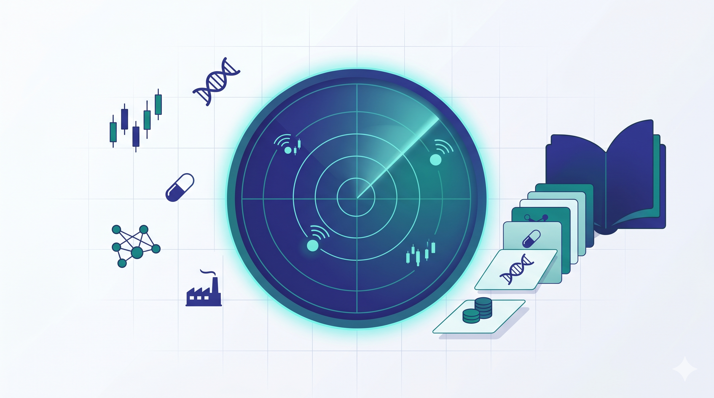
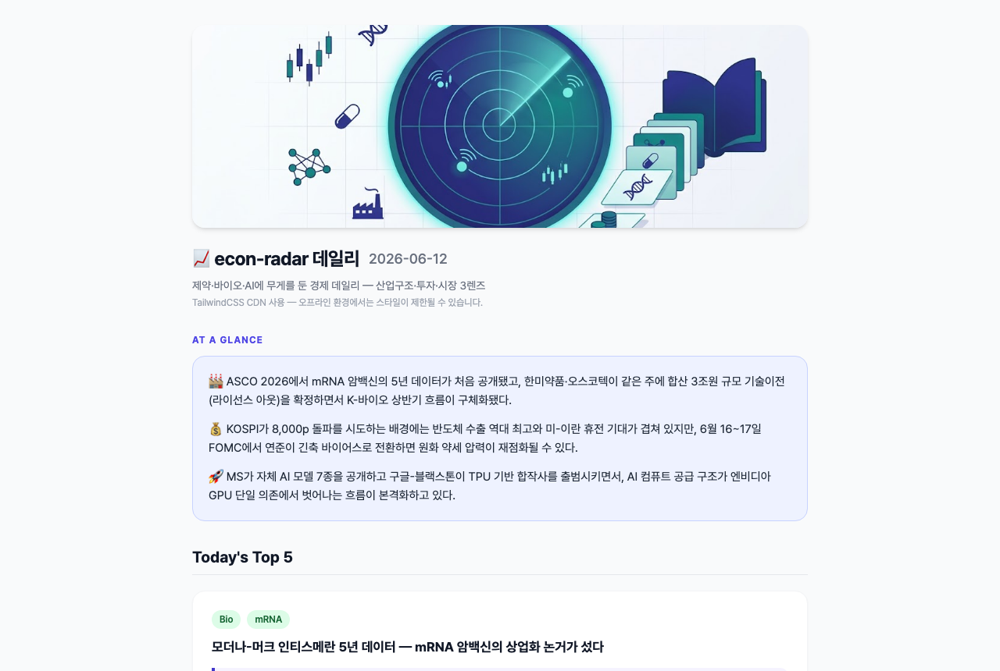
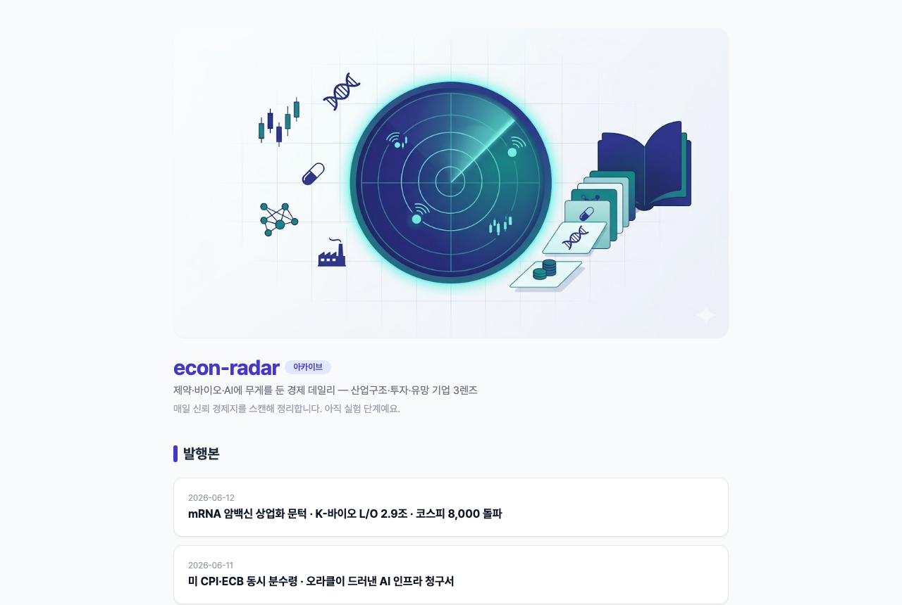
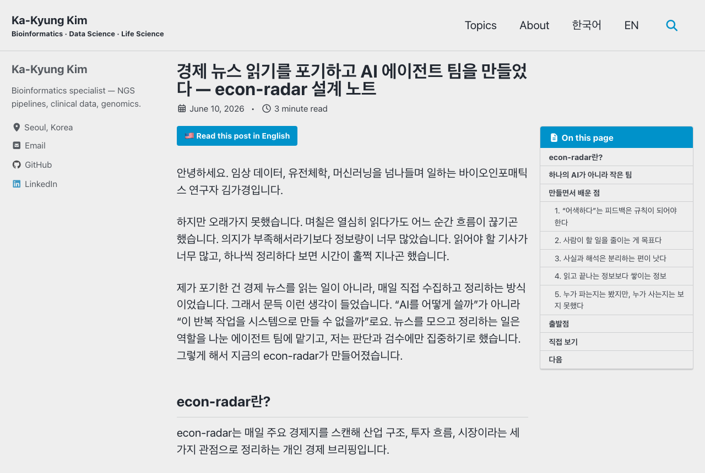

<!-- _class: lead -->

# econ-radar
## 뉴스레터를 매일 돌아가는 팀으로 만들었다

경제 뉴스를 매일 **3렌즈**로 정리해 **자동 발행**하고, 그 기록을 **리포트, 블로그, 책**으로 키우는 개인 지식 자산 시스템

다비코단 발표 · 2026-06-27 · 블로그, 텔레그램, 이메일 3채널

---

## 한 장 요약

- **문제** : 매일 같은 품질로 경제 뉴스를 정리하기. 사람이 직접 하면 피로가 쌓이고 품질이 흔들린다.
- **해법** : 일을 **에이전트 팀과 작업 매뉴얼(스킬)** 로 나눠 매일 자동으로 돌린다.
- **차별점** : 한 번 쓰고 버리지 않는 **누적**. vault(옵시디언)에 쌓아 동향, 블로그, 책으로 키운다.
- **운영** : 매일 18:30 KST에 만들어 블로그, 텔레그램, 이메일로 완전 자동 발행한다. 승인 대신 **사실 검증(fact-check) 게이트**로 거른다.

> 프롬프트 한 번으로 끝나는 게 아니라, 역할과 매뉴얼과 검수와 누적을 갖춘 **작은 조직으로 설계했다.**

---

## 오늘 이야기할 네 가지

<ul class="tl">
<li>Part 1<strong>무엇을, 왜</strong> : 한 줄 정의, 실제 발행본, 3층 구조, 3렌즈</li>
<li>Part 2<strong>어떻게 만들었나</strong> : 8명의 에이전트 팀, 설계 4원칙, 파일로 둔 기준선, 자동화 3채널, OKF 지식 자산화</li>
<li>Part 3<strong>진화</strong> : 17일간 운영과 배포가 설계를 고친 기록, <em>프로덕션이 가르친 것</em></li>
<li>Part 4<strong>원칙, 교훈, 토의</strong> : 안전선, 배운 점, 로드맵, 데모</li>
</ul>

---

<!-- _class: lead -->

## Part 1
# 무엇을, 왜 만들었나

---

## 실제 발행본, 매일 저녁에 나간다

<a href="https://kakyungkim.github.io/econ-radar/2026-06-24.html" target="_blank" rel="noopener">

  
kakyungkim.github.io/econ-radar/2026-06-24.html

  

</a>

▲ 클릭하면 라이브 페이지로 이동

---

## 3층 구조, 오늘이 쌓여 책이 된다

| 층 | 무엇 | 산출물 | 자동화 |
| --- | --- | --- | --- |
| **1층 (매일)** | 수집→분석→편집→검수→검증→렌더 | 일일 뉴스레터, HTML, 푸시 | 매일 18:30 자동 |
| **2층 (자산)** | 옵시디언 vault에 누적 | 태그, 링크, 주제 MOC | 큐레이션 자동 |
| **3층 (저술)** | 쌓인 기록에서 패턴 추출 | 동향 리포트, 블로그, 책 | **주간 리포트 자동** |

 

- 1층은 **매일 돌아가고**, 2층은 **그날의 기록을 주제별로 잇고**, 3층은 **매주 일요일에 모인 흐름을 글로 엮는다.**
- 위 층일수록 사람의 역할이 커진다. 기계는 초안까지 만들고, 최종 판단과 발행은 사람이 하게 한다.

---

## 3렌즈, 무엇을 보는가

뉴스를 늘 같은 세 각도로 나누어 본다.

1. **산업구조 (Industry)** : 판을 흔든 플레이어, 밸류체인의 변화 지점
2. **투자 (Investment)** : 테마, 종목, 리스크, 기회 (코스피와 해외)
3. **시장 (Market)** : 유망 기업(파는 쪽), 수요(사는 쪽)

 

전 분야를 다루되 <strong>제약·바이오·AI</strong>에 무게를 둔다. 제약의 수요는 환자, 처방의, 지불자 셋으로 나눈다. 투자와 유망기업은 매수·매도 권유가 아님을 고지하고, 정보와 시나리오, 리스크로 다룬다.

---

<!-- _class: lead -->

## Part 2
# 어떻게 만들었나: 하네스 구조

---

## 1층 파이프라인, 8명의 팀

  
news-scout 해석 없이 사실만 수집·번역

  
▼

  

    
market-analyst 산업·투자·수요

    
company-scout 유망 기업·수요

  

  
▼ (병렬)

  
newsletter-editor 한 편으로 통합, md 계약 준수

  
▼

  

    
style-critic 문체 게이트, AI 상투구 제거

    
fact-checker 사실 게이트, 수치 원문 대조 ✦new

  

  
▼

  

    
render_html.py 결정적 스크립트 렌더 ✦new

    
knowledge-curator vault 누적·MOC

  

  
newsletter-designer 발행물 시각·반응형 UI · 필요할 때만 ✦new

매일 도는 8명에, 손볼 때만 부르는 <strong>on-demand 디자이너</strong> 1명을 더했다

---

## 설계의 핵심 4가지

- **역할 분리** : 수집가는 해석하지 않고, 분석가는 사실만 다루고, 비평가는 표현만 고친다. 책임을 겹치지 않게 설계한다.
- **매뉴얼화(skill)** : 잘하는 법을 사람 머리에 두지 않고 `SKILL.md`에 적어 둔다. 매일 같은 품질을 유지한다.
- **이중 게이트** : 발행 전에 `style-critic`은 표현을, `fact-checker`는 수치와 출처를 한 번씩 본다. 문체 오류와 사실 오류를 따로 거른다.
- **판단만 LLM에** : HTML 렌더처럼 판단이 필요 없는 단계는 **스크립트로 고정한다.** 토큰을 아끼고 양식이 흔들리지 않게 한다.

---

## 품질을 어떻게 지키나: 기준선은 전부 파일

- **문체 기준선** : `korean-style-samples.md`(실제 기사 표본)를 꼭 참조한다. *"A가 아니라 B", "~인 셈"* 같은 AI 상투구는 금지한다.
- **사실 기준선** : `fact-checker`가 핵심 수치 최대 10개를 원문과 대조한다. 출처 없는 수치는 막고, 단일 소스는 표기하며, 1차 출처(IR·규제기관)를 명시한다.
- **깊이 기준선** : `benchmarks.md`에 Why it matters 한 줄, 1차 자료 직접 링크해서 양면 시각을 다룬다.
- **수요 렌즈** : `demand-lens.md`에서 투자자는 공급과 자본으로, Demand는 수요로 본다.
- **양식 기준선** : `NEWSLETTER-FORMAT.md` 계약과 템플릿 렌더로 양식이 흐트러지지 않는다.

> 기준선을 **파일에 둔 게 핵심이다.** 에이전트가 매번 같은 잣대를 본다.

---

## 자동화: 클라우드 루틴과 3채널 발행

| 루틴 | 언제 | 하는 일 |
| --- | --- | --- |
| **데일리** 완전 자동 | 매일 18:30 KST | 수집→분석→편집→검수→검증→렌더→큐레이션→**블로그·텔레그램·이메일** |
| **주간 동향** | 일요일 21:00 KST | 한 주치에서 패턴 추출, `reports/` 동향 리포트(3층) |

 

- 왜 저녁 18:30 : 한국 장 마감 뒤라 그날 국내 시장을 온전히 담는다. 미국 장은 아침 수집이 유리하지만 국내 반영을 앞세웠다.
- 저녁에 동시 발송 : 같은 git push가 블로그, 텔레그램, 이메일(Buttondown) 워크플로를 한꺼번에 깨워 세 채널이 거의 동시에 도착한다.
- 승인 게이트 폐기 : 발행 전 사람 승인을 이틀 만에 접었다. "확인 전까지 미발송"에서 "발송하되 이상하면 취소"로 바꿨다.
- vault 전체 추적 : private git에 통째 담아, 클라우드가 과거를 읽고 여러 주의 흐름을 잇는다.

<!-- 발표자 노트(Q&A): Buttondown을 고른 이유 — 구독자 관리, 수신거부, GDPR을 대신 처리하고, 무료로 100명까지, API 한 번으로 기존 파이프라인에 스텝 하나만 더하면 됐다. -->

---

## OKF: LLM이 읽는 지식 표준

마크다운과 링크로 지식을 쌓아 LLM이 읽게 하는 'LLM 위키' 패턴. Google Cloud가 2026년 6월 이걸 개방 표준 OKF(Open Knowledge Format)로 정리했고, econ-radar vault가 그 표준을 따른다.

- **파일 경로가 곧 개념 ID.** `topics/AI.md`는 개념 'AI'. 폴더만 열면 옵시디언 그래프와 백링크가 산다.
- 필수 항목은 **`type` 한 줄**만 두고, 진입점은 `index.md`에, 변경 이력은 `log.md`에 담는다.
- 링크는 **절대경로 마크다운** `[AI](/topics/AI.md)`. 위키링크와 달리 어디서 열어도 안 깨진다.

> SDK도 DB도 없고, 마크다운과 YAML만 쓴다.

---

## 한 폴더, 셋이 동시에 읽는다

OKF로 맞추면 vault 폴더 하나가 충돌 없이 세 가지로 동시에 쓰인다.

- **옵시디언 vault**: 그래프와 백링크로 탐색
- **LLM 위키**: 에이전트가 `cat`으로 읽어 질의
- **git 저장소**: `git diff`로 버전 관리, `clone`으로 배포

바꾼 건 링크 문법 하나. econ-radar는 6/24에 위키링크 1,228개를 절대경로 마크다운으로 옮겨 한 번에 세 가지를 모두 만족시켰다.

> `cat`으로 읽히면 OKF, `git clone`으로 받으면 배포.

---

## 2층 자산화: 스트림에서 포트폴리오로

- **프로젝트 vault는 스트림이다.** econ-radar의 daily, raw, analysis가 매일 쌓인다.
- 단순히 쌓이기만 하면 자산이 못 되고 노이즈로 남을 수 있다. 그래서 **큐레이터가 오래 쓸 주제만 골라 승격**시킨다.
- 승격한 주제가 모이는 곳이 **knowledge-hub**, 프로젝트를 가로지르는 포트폴리오 위키다. econ-radar와 paper-radar가 같은 OKF 표준으로 한곳에 모인다.

  

    
프로젝트 vault스트림 · daily, raw, analysis

    
승격 ▶

    
knowledge-hub자산 · MOCs, topics

  

> 규약은 전역 한 곳, 자산은 허브, 변환은 자동. repo마다 규약을 복사하지 않는다.

---

<!-- _class: lead -->

## Part 3
# 진화: 운영과 배포가 설계를 고친다

---

## 1주차: 5일간의 진화, 운영이 설계를 고친다

<ul class="tl">
<li>6/09하네스 구축, 첫 발행. 깊이가 부족해 보여 항목 수와 Why it matters를 규칙으로 박았다</li>
<li>6/10문체가 AI 같아 보여 실제 기사 표본을 들이고 style-critic 게이트를 달았다. 렌즈도 커리어에서 유망기업으로 교체했다</li>
<li>6/11"투자자 관점에 치우쳤다"는 스터디 피드백에 <strong>수요(Demand) 렌즈</strong>를 더했다. 클라우드 루틴도 가동했다</li>
<li>6/12승인 게이트를 접고 <strong>완전 자동 발행</strong>으로 바꿨다. 텔레그램 채널도 추가했다</li>
<li>6/13구조를 다시 보고 <strong>4건을 한꺼번에 개선</strong>: 사실 게이트, vault 전체 추적, 렌더 스크립트화, 주간 3층 루틴</li>
</ul>

> *어색하다, 치우쳤다 같은 막연한 불만을 그때마다 파일로 된 규칙과 게이트로 바꿨다. 늘 같은 패턴이었다.*

---

## 6/13 구조 검토, 비판이 곧 백로그

발행 4호 시점에 하네스를 스스로 비판해 보고, 우선순위 4건을 바로 적용했다.

| 발견한 문제 | 처방 |
| --- | --- |
| 게이트가 문체뿐, 잘못된 수치가 그대로 나간다 | `fact-checker` 신설 (T4.7) |
| 3층(저술)이 비어 있다, forcing function 부재 | 주간 동향 루틴 (일 21:00) |
| 클라우드가 과거를 못 본다 (vault 로컬 전용) | 레포 private, vault 전체 추적 |
| 렌더가 제일 비싼데(93K 토큰) 판단은 불필요 | `render_html.py` 스크립트화 |

남은 건(MOC 요약 구조, 백로그 트리아지) TODO로 미뤘다. 검토 전문은 <code>vault/_meta/2026-06-13-harness-review.md</code>

---

## 2주차~3주차: 채널 확장과 프로덕션 (6/14 → 6/25)

<ul class="tl">
<li>6/14미뤄둔 백로그를 처리했다. MOC 갱신 규칙, 렌즈 범위 분리, 승격 기준을 문서로 정리했다</li>
<li>6/15텔레그램 직접 발송이 네트워크에 막혀 <strong>GitHub Actions(push 감지)로 발송을 옮겼다</strong></li>
<li>6/16–18Actions 다중커밋 감지 버그를 고치고 <strong>뉴스 신선도와 중복 방지</strong> 추가. 같은 약과 기업이 며칠씩 반복되던 에이전트 관성을 걷어냈다</li>
<li>6/24옵시디언에서 <strong>OKF 포맷으로 마이그레이션했다</strong>. 위키링크 1,228개를 변환하고 frontmatter와 index/log를 정리했다</li>
<li>6/25<strong>이메일 채널을 가동했다</strong>(Buttondown). 저녁에 텔레그램과 동시 발송한다. 첫 자동 발송이 API 헤더 누락으로 막혀 바로 고쳤다. 발음, 버튼, 섹션 목차도 함께 다듬었다</li>
</ul>

> 1주차 패턴이 그대로 이어진다. *운영과 배포가 새 실패 모드를 드러내면, 그게 규칙과 게이트, 채널로 바뀐다.*

---

## 프로덕션이 가르친 것: 채널을 늘리며 부딪힌 벽

| 증상 (어디서) | 진짜 원인 | 하네스 교훈 |
| --- | --- | --- |
| 이메일 버튼·글씨가 깨짐 | 메일은 JS와 외부 CSS가 안 먹고, 클라이언트가 링크색을 덮어씀 | **로컬에서 된다고 받은편지함에서 되는 게 아니다.** 인라인 CSS, table, `!important` |
| 이메일 첫 자동 발송이 400 거부 | Buttondown이 즉시 발송에 `X-Buttondown-Live-Dangerously` 헤더를 요구 | 외부 발송 API의 안전장치는 draft가 아니라 **실전 발송에서만** 드러난다 |
| 새 데일리가 옛 포맷으로 회귀 | OKF 규약이 `~/.claude` 전역에만 있어 **클라우드가 못 봄** | 규약과 기준선은 **레포 안에** 둬야 유지된다 |
| 발음이 엉뚱한 단어 | 표제어 대신 괄호 속 영어 설명을 읽음 | **데이터에서 렌더로 가는 계약**을 명시(표제어 = 발음) |
| "고쳤는데 그대로" | 배포 워크플로 지연에 브라우저·CDN 캐시까지 | 라이브는 **curl로 검증하고** 캐시를 의심한다 |

> 채널마다 런타임이 다르다. 같은 산출물도 **배달 환경에서 다시 검증해야 한다.**

---

## 운영 비용: 측정으로 줄이기

1회 발행에 **약 43만 토큰, 벽시계로 25분쯤** 든다 (`run-metrics.md`에 단계별 누적)

  
렌더 report-renderer

93K, 가장 비쌌던 단계

  
→ render_html.py

≈0

  
통합 editor

78K

  
수집 news-scout

62K

  
큐레이션 curator

57K

  
문체 검수 style-critic

51K

  
분석 2종 (병렬)

87K

 

제일 비싼 단계가 정작 판단은 가장 덜 필요했다. 스크립트로 갈아 <strong>발행당 약 22% 절감</strong>.

---

<!-- _class: lead -->

## Part 4
# 원칙, 교훈, 토의

---

## 안전선: 하지 않는 것

- **자동 발행은 데일리에만** : 블로그 발행과 텔레그램 알림만 승인된 자동 동작이다. 메일과 메신저 대량 전송, 출판은 여전히 사람이 승인해야 나간다.
- **매수·매도 권유 금지** : 투자와 유망기업은 정보, 시나리오, 리스크로만 다룬다.
- **출처 없는 수치 생성 금지** : fact-checker가 출처 없는 수치를 발행 전에 막는다. 추정은 "추정"이라 밝힌다.

> 자동화의 신뢰는 *무엇을 자동으로 하느냐*보다 *무엇을 자동으로 안 하느냐*에서 온다.

---

## 하네스로 배운 점 (스터디 토의용)

- **일을 조직으로 본다** : 프롬프트 한 방으로 끝내지 않고, 역할과 매뉴얼, 검수, 누적을 갖춘 작은 팀으로 운영한다.
- **지식은 파일에 둔다** : 기준선과 표본, 계약을 파일에 두면 품질이 사람에게 묶이지 않는다.
- **게이트는 실패 모드별로** : 문체 게이트는 어색함을, 사실 게이트는 오류를 막는다. 자동 발행일수록 사실 게이트가 먼저다.
- **판단과 기계 작업을 가른다** : 판단 없는 단계(렌더)는 스크립트로 고정하고, 판단하는 단계만 LLM에 맡긴다.
- **운영이 설계를 고친다** : 17일간 거의 매일 구조가 바뀌었다. 모두 운영하다 나온 불만에서 출발했다.
- **배달 환경마다 다시 검증한다** : 로컬 성공이 전부가 아니다. 이메일, 클라우드, 캐시는 저마다 다른 런타임이다.

 

→ 토의: 여러분의 반복 업무에서 "판단이 필요한 단계"와 "기계로 굳힐 단계"는 어디서 갈릴까요?

---

## 솔직한 미완: 다음 백로그

- **OKF 지속성** : 마이그레이션은 했지만 클라우드 에이전트가 아직 옛 포맷으로 만든다. 규약을 **레포 안으로** 옮겨야 자리잡는다(지금은 매일 클린업이 필요).
- **발송 실패 알림** : 한 채널이 조용히 실패해도(이번 이메일 400처럼) 자동으로 알 길이 없다. 워크플로 실패를 텔레그램이나 이슈로 알리는 일을 다음 과제로 둔다.
- **중복 규칙 검증** : "한 사건은 한 번만 서술" 규칙을 넣었으니, 실제 발행본에서 중복감이 줄었는지 며칠 더 본다.

> 하네스는 완성으로 끝나지 않고 **백로그가 계속 돌게 한다.** 스스로 비판한 점이 그대로 다음 할 일이 된다.

---

## 직접 보기: 아카이브와 설계 노트

<!-- 발표자 노트(시연 동선):
1. 라이브 발행본: 오늘자 블로그 리포트를 열어 목차로 점프, 영어 단어 발음 재생.
2. 옵시디언 그래프와 cat: vault를 옵시디언으로 열어 주제 MOC와 데일리가 엮인 그래프 보여주기. 터미널에서 cat vault/topics/AI.md로 "그냥 마크다운" 확인.
3. LLM이 vault를 읽는다: "최근 2주 GLP-1 흐름 정리해줘"를 vault만 보고 답하게. 연결된 자산이 곧 물어볼 수 있는 지식.
라이브 링크: 블로그 kakyungkim.github.io/econ-radar, 텔레그램 @econradar, 이메일 받은편지함 -->

  <a style="flex:1; min-width:0;" href="https://kakyungkim.github.io/econ-radar/" target="_blank" rel="noopener">
  

    
kakyungkim.github.io/econ-radar/

    
  

  </a>
  <a style="flex:1; min-width:0;" href="https://kakyungkim.github.io/kr/2026/06/10/econ-radar-agent-harness/" target="_blank" rel="noopener">
  

    
…/econ-radar-agent-harness/ (설계 노트 블로그)

    
  

  </a>

▲ 클릭하면 각 페이지로 이동

---

<!-- _class: lead -->

# 감사합니다

**econ-radar** : 매일 돌아가는 3렌즈 뉴스 팀, 이중 게이트, 3채널 발행, 누적되는 지식 자산

QR은 econ-radar 아카이브. 발행 채널은 블로그, 텔레그램 @econradar, 이메일 셋. 데모는 오늘자 HTML 리포트.
